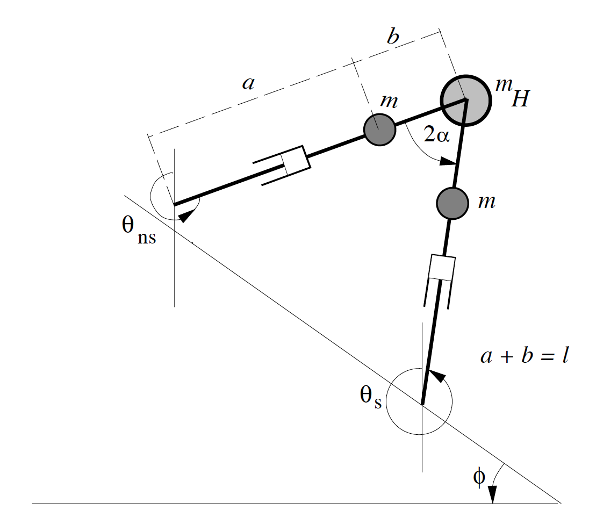
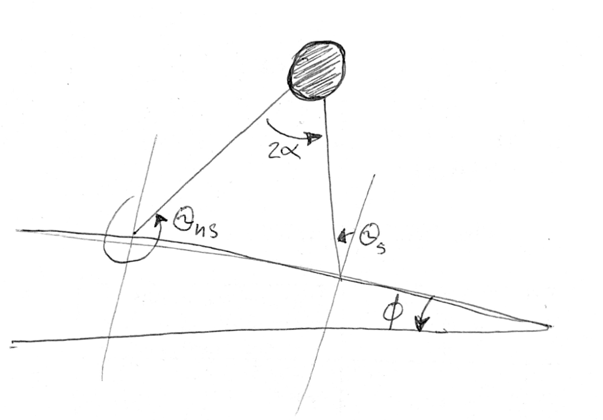
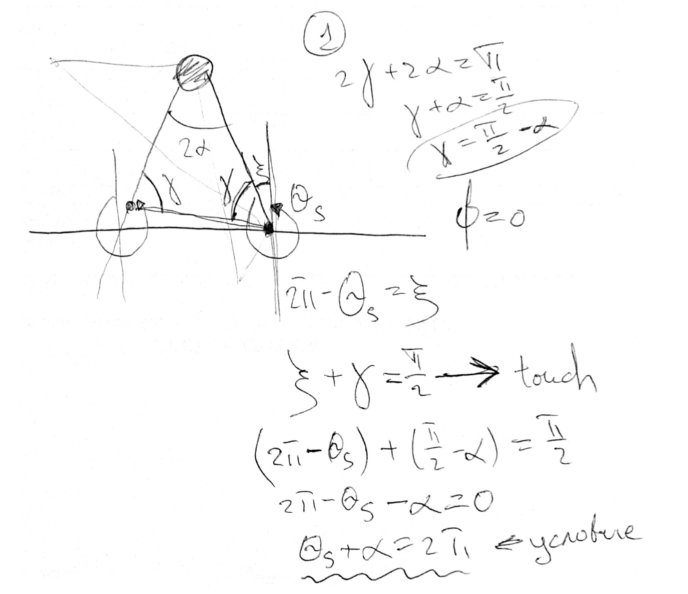

# Bipedal passive gait animation
An animation utilite for state-space model of a compass-like biped walker

## Latest notebook

Check [playground-2](playground-2.ipynb) jupyter notebook.

## System desription

This picture doesn't quite capture the essence of what's going on because the angle is usually small. Let us redraw it a bit

You can see from this picture that

$$
   2 \alpha = \theta_{ns} + \theta_{s}
$$

State-space: 
$$
    q = [ \theta, \ \dot \theta ]^T = [ \theta_{ns}, \theta_{s}, \ \dot \theta_{ns}, \dot \theta_{s} ]^T
$$

The swing stage equations of the robot similar to that of a frictionless double pendulum  can be written as:
$$
    M(\theta) \ddot \theta + N(\theta, \dot \theta) \dot \theta + \frac{1}{a} g(\dot \theta) = 0
$$

where $ \mu = \frac{m_H}{m}, \beta = \frac{b}{a}$ – normalazed peremeters and 

$$
    M(\theta) =
    \begin{pmatrix}
        \beta^2 & -(1 + \beta) \beta \cos 2 \alpha \\
        -(1 + \beta) \beta \cos 2 \alpha & (1 + \beta)^2 (\mu + 1) + 1
    \end{pmatrix}
$$

$$
    N(\theta, \dot \theta) =
    \begin{pmatrix}
        0 & (1 + \beta) \beta \dot \theta_{ns} sin(\theta_{s} - \theta_{ns}) \\
        -(1 + \beta) \beta \dot \theta_{ns} sin(\theta_{s} - \theta_{ns}) & 0
    \end{pmatrix}
$$

$$
    N(\theta, \dot \theta) =
    \begin{pmatrix}
        0 & (1 + \beta) \beta \dot \theta_{ns} sin(\theta_{s} - \theta_{ns}) \\
        -(1 + \beta) \beta \dot \theta_{ns} sin(\theta_{s} - \theta_{ns}) & 0
    \end{pmatrix}
$$

$$
   - M(\theta) \ddot \theta =  N(\theta, \dot \theta) \dot \theta + \frac{1}{a} g(\dot \theta)
$$

Since $ \mu \in [0.1; 10] $ and $ \beta \in [0.1; 10] $, $ M(\theta)^{-1} $ exists, so

$$
     \ddot \theta = - M(\theta)^{-1} ( N(\theta, \dot \theta) \dot \theta + \frac{1}{a} g(\dot \theta) )
$$

Using $ z = \dot \theta $:

$$
    q = [\theta, z]
$$

$$
    \dot q = [z, - M(\theta)^{-1} ( N(\theta, z) z + \frac{1}{a} g(z) ) ]
$$

Now we can use solvers to integrate equivalent first-oder differential equation `q_dot = f(q, t)`

Ground impact of the swing leg with the ground is assumed to be slipless plastic. The pre-impact and the post-impact configurations of the robot can be simply related by permutation of $ \theta $ components. The post-impact joint velocity of the biped can be computed via the conservation of angular momentum principle.

$$
    W(\alpha) =
    \begin{pmatrix}
        J & 0 \\
        0 & H(\alpha)
    \end{pmatrix} =
    \begin{pmatrix}
        J & 0 \\
        0 & ( Q^{+}(\alpha) )^{-1} Q^{-}(\alpha) 
    \end{pmatrix}
$$

$$
   J =
    \begin{pmatrix}
        0 & -1 \\
        1 & 0
    \end{pmatrix}
$$

$$
    Q^{-}(\alpha) =
    \begin{pmatrix}
        -\beta & -\beta + ( \mu(1 + \beta)^2 + 2(1 + \beta) ) \cos 2 \alpha \\
        0 & -\beta
    \end{pmatrix}
    , \quad
    Q^{+}(\alpha) =
    \begin{pmatrix}
        \beta( \beta - (1 + \beta) \cos 2 \alpha ) & (1 + \beta)( (1 + \beta) - \beta \cos 2 \alpha ) + 1 + \mu(1 + \beta)^2
        \\
        \beta^2 & -\beta ( 1 + \beta) \cos 2 \alpha
    \end{pmatrix}
$$

## Step detection

### Problem setup

To write down the differential equation with a discontinuous right-hand side describing the motion of the robot, we need to write down the condition for switching between steps. This moment is corresponding to the moment

### Floating base approach

A fairly straightforward method would involve calculating the swinging coordinates of the foot relative to the zero coordinate at the support point during a given phase of walking. At the moment of leg switching zero coordinate is shifting so it could be natuarally called *floating base*.

### Angles comparation aproach 

The drawing has to be fixed, but represent main idea.

## Programm realization

The numerical simulation is based on `scipy` python package. Relative tolerance of the solver **RK45** is set to $1e-5$, absolute tolerance is set to $1e-7$. At each point os time switching condition is checked. If legs has to be switched, we restart solver with new state vector $ W(q_{[k]})q_{[k]} $.

## Sources
1. Goswami A., Thuilot B., Espiau B. A study of the passive gait of a compass-like biped robot: Symmetry and chaos //The International Journal of Robotics Research. – 1998. – Т. 17. – №. 12. – С. 1282-1301.
2. Spong M. W., Bhatia G. Further results on control of the compass gait biped //Proceedings 2003 IEEE/RSJ International Conference on Intelligent Robots and Systems (IROS 2003)(Cat. No. 03CH37453). – IEEE, 2003. – Т. 2. – С. 1933-1938.